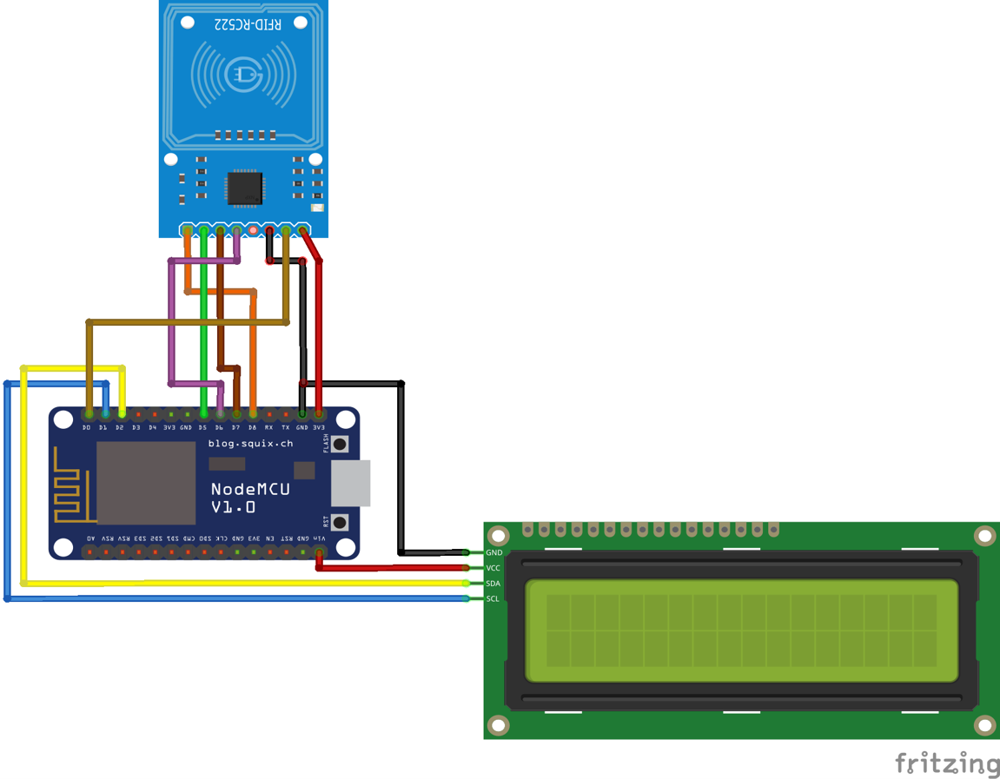
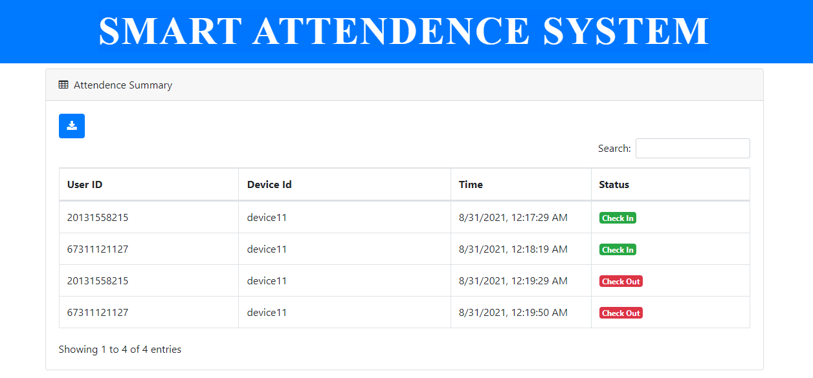
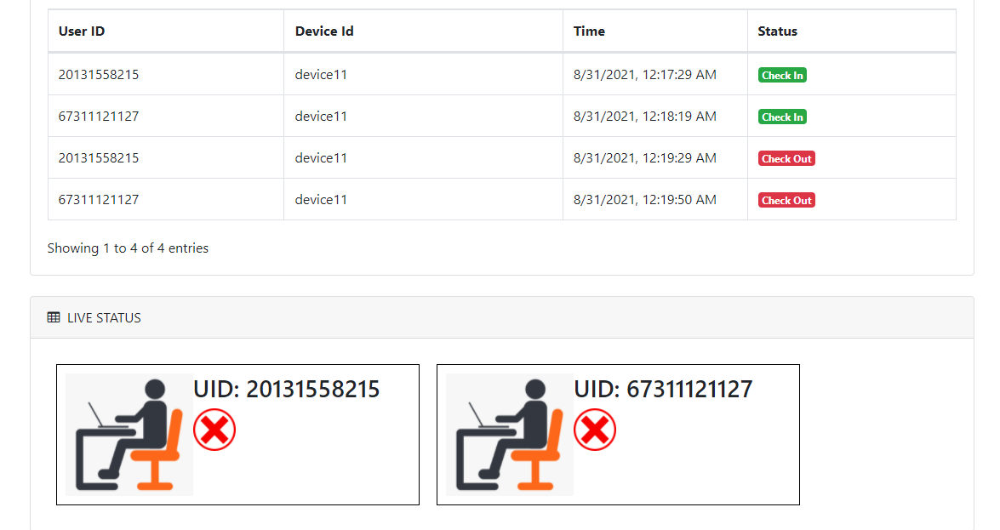

# Smart Attendance System

## CODE WITH DESCRIPTION

1. init/init.ino -> Arduino code for adding users (RFID tags UUID) to Firebase database.

2. firebase/firebase.ino -> Arduino code for monitoring users/attendes.

3. attendence-system -> Web dashboard code

## CIRCUIT DIAGRAM

## WEB DASHBOARD

## LINK FOR WRITTEN BLOG

